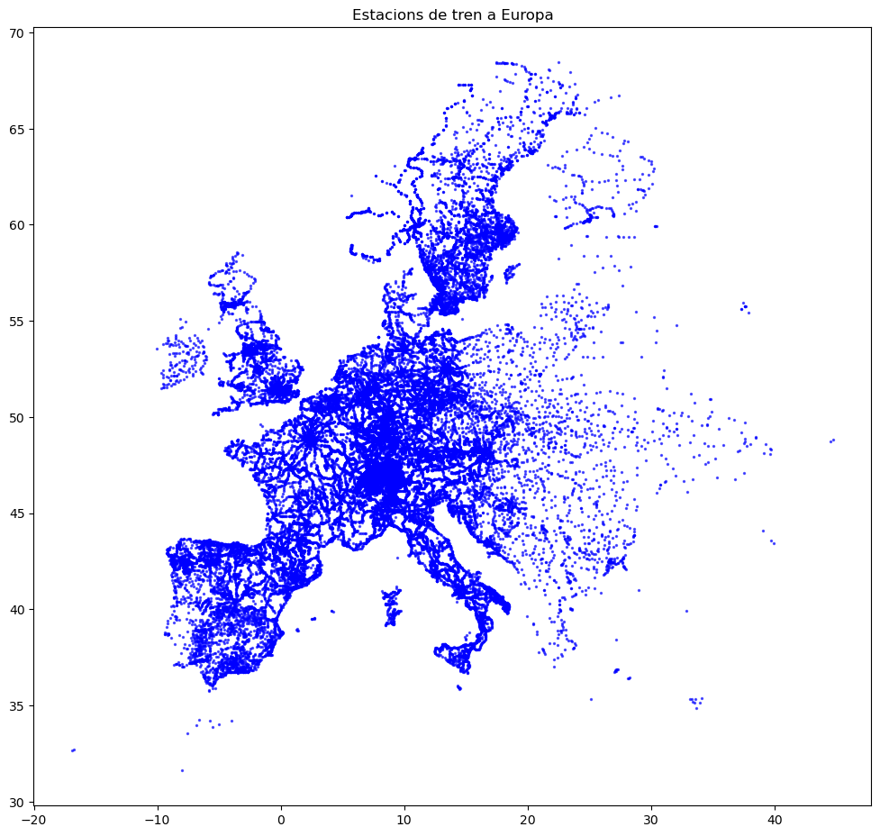
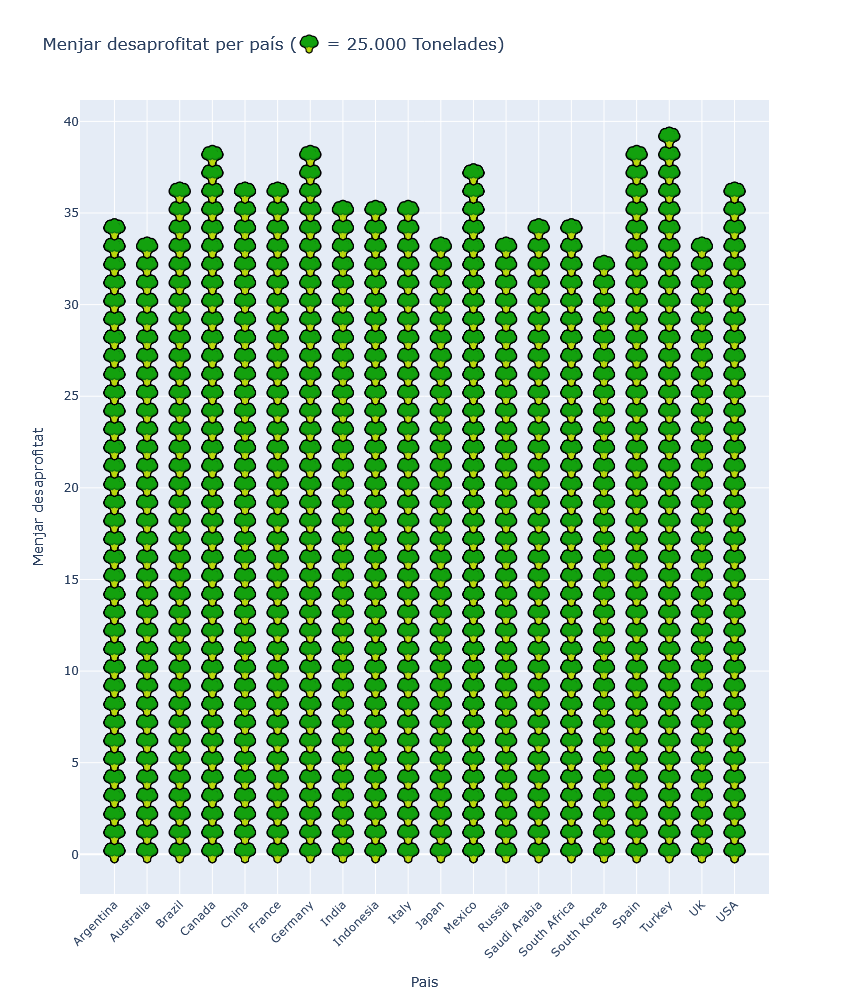
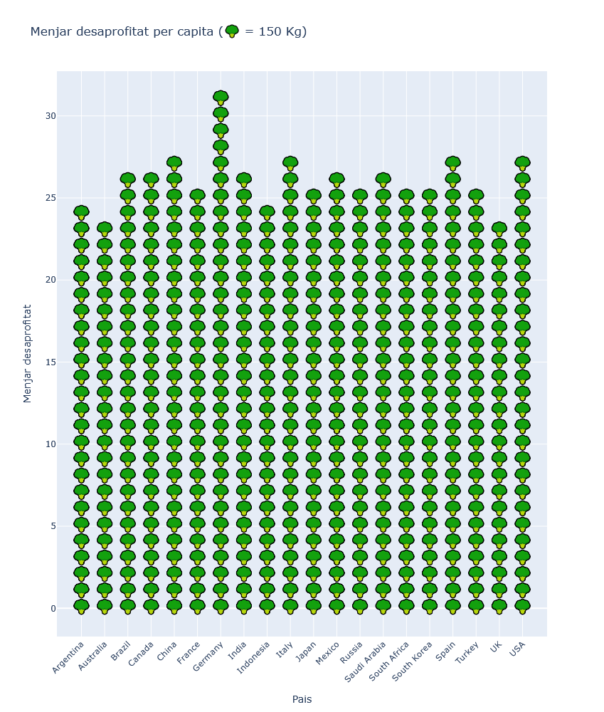
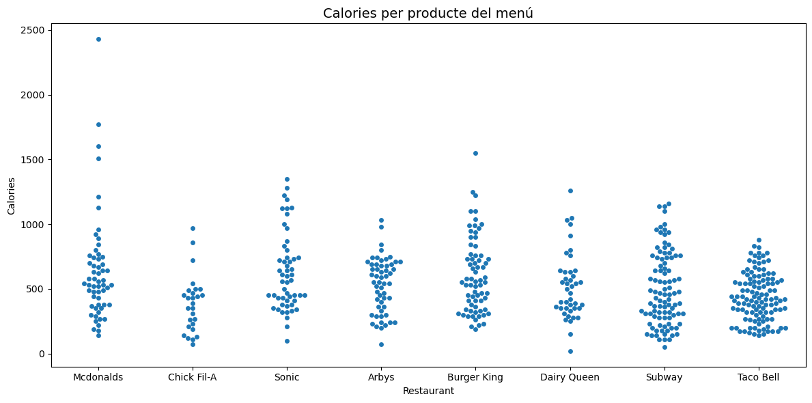

# Visualització de dades - PAC 2
### Esther Ruano Hortoneda
### Octubre 2025

# [Dot Density Map](https://datavizproject.com/data-type/dot-density-map/)
És una visualització que utilitza punts o altres símbols per indicar la presència d'un fenòmen en un mapa. Poden ser de tipus One-to-One, on cada punt representa un esdeveniment, o One-to-Many, on cada punt representa una quantitat predeterminada d'esdeveniments (per exemple, un punt per a cada 100 casos).

Per obtenir la informació llistada a continuació, he consultat [The Encyclopedia of Geography (pp.787-790). Robert E. Roth](https://www.researchgate.net/publication/271079352_Dot_density_maps) i la [Wikipedia](https://en.wikipedia.org/wiki/Dot_distribution_map).

## Origen i autoria:
Neixen a principis del segle 19: a mesura que les dades estadísitques eren més fàcils d'obtenir i anaven sent reconegudes per la comunitat científica com a font d'informació es comencen a crear [mapes temàtics](https://en.wikipedia.org/wiki/Thematic_map), entre els quals apareixen els de densitat de punts. 

Es considera que la primera instància d'aquest tipus de mapes podria ser el creat per Valentine Seaman l'any 1797 per analitzar els casos de febre groga a la ciutat de Nova York. Tot i que la quantitat de punts és molt petita i, per tant, no queda clar que es pugui considerar mapa de densitat depunts, és bo veure'l com el primer ús d'un mapa per fer analisis i comunicació d'epidemies.

Trobem, l'any 1830 el mapa d'Armand Joseph Frère de Montizon, un frare Franciscà on cada punt representa 10 mil habitants i serveix per veure la població de cada districte. La tècnica que utilitza (calcular la quantitat de punts corresponents a cada districte i repartir-los) es segueix fent servir avui en dia per mostrar densitat de població. Van haver de passar 30 anys fins que, per al cens de Suècia i Noruega de 1855 es van posicionar els punts en funció de la distribució de la població dins un districte, no només repartint-los a l'atzar.

||  |
|-|-|
|Mapa de Valentine Seaman: casos de febre groga a Nova York (1797) ([font](https://en.wikipedia.org/wiki/Dot_distribution_map))| Mapa d'Armand Joseph Frère de Montizon: població de França per districte (1830) ([font](https://en.wikipedia.org/wiki/Dot_distribution_map))|

A més dels mapes per a població, l'estudi d'epidèmies de la primera meitat del segle 19 va motivar també l'aparició d'aquest tipus de mapes; on un punt representava cada un dels casos de còlera, com ara el de Thomas Shapter per la ciutat d'Exeter o el de John Snow pel districte de Soho a Londres. Aquests mapes, a més de la capacitat divulgativa dels anteriors, servien com a eines d'anàlisi que van permetre entendre com la còlera es contagiava.

|||
|-|-|
|Mapa de Thomas Shapter: casos de còlera a Èxter (1849) ([font](https://en.wikipedia.org/wiki/Dot_distribution_map))| Mapa de Jphn Snow: casos de còlera a Londres (1854) ([font](https://en.wikipedia.org/wiki/Dot_distribution_map))|

## Avantatges i inconvenients
### Avantatges
* Visualment intuïtiu: mostra ràpidament la distribució espacial d’un fenomen.
* Expressa densitat i localització alhora.
* Permet comparacions espacials entre regions.
* Adequat per dades discretes (p. ex., localització d’esdeveniments).
### Inconvenients
* Dificultat de lectura si hi ha massa punts: cal trobar el ràtio esdeveniments-per-punt adequat.
* No mostra exactament el valor real: els punts representen valors agregats.
* Subjectivitat en l’escala (nombre de punts per unitat o superfície).

## Tipus de dades admeses:
* Valors associats a geografia
* Dades quantitatives discretes (comptes, quantitats)
* Dades estadístiques totals o agregades per zones (per exemple, població per municipi, nombre de granges, vehicles, crims, etc.).
* No són adequats per a dades contínues (com temperatura o altitud).

## Exemples i aplicacions habituals
* **Demografia**: distribució de la població dins d’un país o regió.

||
|-|
|Mapa de Thure Alexander von Mentzer: població de Suècia i Noruega tenint en compte densitat de població (1859) ([font](https://en.wikipedia.org/wiki/Dot_distribution_map))|

* **Agricultura**: nombre d’explotacions agrícoles o caps de bestiar.

||
|-|
|Producció agrícola i vegetal l'any 2017 als Estats Units ([font](https://www.researchgate.net/figure/Dot-density-map-of-fruit-and-vegetable-production-in-2017_fig3_361111924))|


* **Economia**: localització d’empreses, llocs de treball o centres comercials.

||
|-|
|Distribució de cadenes de menjar ràpid als Estats Units ([font](https://flowingdata.com/2014/06/24/burger-place-geography/))|

* **Medi ambient**: punts d’incendis, fonts de contaminació o observacions d’espècies.

||
|-|
|Incendis a Espanya els anys 1968–2023 ([font](https://datainnovation.org/2025/08/extinguishing-wildfires-in-spain/)). En aquest mapa, la mida dels punts indica l'extensió de l'incendi dins el mapa, i el color la durada de l'incendi.|

* **Criminologia**: punts de delictes per zones urbanes.

||
|-|
|Assasinats a Washington D.C. entre els mesos de Novembre de 2004 i 2006 ([font](https://en.wikipedia.org/wiki/Dot_distribution_map))|

* **Sanitat**: casos d’una malaltia (epidemiologia)

||
|-|
|Mapa de Jphn Snow: casos de còlera a Londres (1854) ([font](https://en.wikipedia.org/wiki/Dot_distribution_map))|


## Visualització

Farem servir [`geopandas`](https://geopandas.org/en/stable/docs.html) per organitzar les dades geogràfiques i dibuixar-les fent servir `GeoDataFrame`.  Amb [`pandas`](https://pandas.pydata.org/docs/) farem una mica de neteja de les dades: no volem aquelles files on els valors de latitud o longitud siguin nuls. [`matplotlib`](https://matplotlib.org/) servirà per organitzar les visualitzacions de dades i [`kagglehub`](https://github.com/Kaggle/kagglehub) per descarregar les dades.

Farem servir [aquest dataset](https://www.kaggle.com/datasets/headsortails/train-stations-in-europe) que conté les coordenades de les estacions de trens a Europa.


```python
import geopandas as gpd
import matplotlib.pyplot as plt
import kagglehub
import pandas as pd

# Descarrega de les dades
path = kagglehub.dataset_download("headsortails/train-stations-in-europe")

print("Arxiu descarregat a:", path)
```

    Arxiu descarregat a: C:\Users\esthe\.cache\kagglehub\datasets\headsortails\train-stations-in-europe\versions\22
    


```python
# Carrega dades i neteja columnes
df = gpd.read_file(path + "\\train_stations_europe.csv", encoding="utf8")

print('Mida original del dataset:', df.shape)

df = df[pd.to_numeric(df['latitude'], errors='coerce').notnull()]
df = df[pd.to_numeric(df['longitude'], errors='coerce').notnull()]

print('Mida del dataset després de la neteja:', df.shape)
df.head()
```

    Mida original del dataset: (64037, 14)
    Mida del dataset després de la neteja: (62142, 14)
    


<div>
<table border="1" class="dataframe">
  <thead>
    <tr style="text-align: right;">
      <th></th>
      <th>id</th>
      <th>name</th>
      <th>name_norm</th>
      <th>uic</th>
      <th>latitude</th>
      <th>longitude</th>
      <th>parent_station_id</th>
      <th>country</th>
      <th>time_zone</th>
      <th>is_city</th>
      <th>is_main_station</th>
      <th>is_airport</th>
      <th>entur_id</th>
      <th>entur_is_enabled</th>
    </tr>
  </thead>
  <tbody>
    <tr>
      <th>0</th>
      <td>1</td>
      <td>Château-Arnoux—St-Auban</td>
      <td>Chateau-Arnoux-St-Auban</td>
      <td>NA</td>
      <td>44.08179</td>
      <td>6.001625</td>
      <td>NA</td>
      <td>FR</td>
      <td>Europe/Paris</td>
      <td>TRUE</td>
      <td>FALSE</td>
      <td>FALSE</td>
      <td>NA</td>
      <td>FALSE</td>
    </tr>
    <tr>
      <th>1</th>
      <td>2</td>
      <td>Château-Arnoux—St-Auban</td>
      <td>Chateau-Arnoux-St-Auban</td>
      <td>8775123</td>
      <td>44.0615651</td>
      <td>5.9973734</td>
      <td>1</td>
      <td>FR</td>
      <td>Europe/Paris</td>
      <td>FALSE</td>
      <td>TRUE</td>
      <td>FALSE</td>
      <td>NA</td>
      <td>FALSE</td>
    </tr>
    <tr>
      <th>2</th>
      <td>3</td>
      <td>Château-Arnoux Mairie</td>
      <td>Chateau-Arnoux Mairie</td>
      <td>8775122</td>
      <td>44.063863</td>
      <td>6.011248</td>
      <td>1</td>
      <td>FR</td>
      <td>Europe/Paris</td>
      <td>FALSE</td>
      <td>FALSE</td>
      <td>FALSE</td>
      <td>NA</td>
      <td>FALSE</td>
    </tr>
    <tr>
      <th>3</th>
      <td>4</td>
      <td>Digne-les-Bains</td>
      <td>Digne-les-Bains</td>
      <td>NA</td>
      <td>44.35</td>
      <td>6.35</td>
      <td>NA</td>
      <td>FR</td>
      <td>Europe/Paris</td>
      <td>TRUE</td>
      <td>FALSE</td>
      <td>FALSE</td>
      <td>NA</td>
      <td>FALSE</td>
    </tr>
    <tr>
      <th>4</th>
      <td>6</td>
      <td>Digne-les-Bains</td>
      <td>Digne-les-Bains</td>
      <td>8775149</td>
      <td>44.088710133980605</td>
      <td>6.222982406616211</td>
      <td>4</td>
      <td>FR</td>
      <td>Europe/Paris</td>
      <td>FALSE</td>
      <td>TRUE</td>
      <td>FALSE</td>
      <td>NA</td>
      <td>FALSE</td>
    </tr>
  </tbody>
</table>
</div>


```python
# Convertir a GeoDataFrame
gdf = gpd.GeoDataFrame(df, geometry=gpd.points_from_xy(df.longitude, df.latitude), crs="EPSG:4326")

# Pintar
fig, ax = plt.subplots(figsize=(12,20))
gdf.plot(ax=ax, markersize=2, color='blue', alpha=0.6)
ax.set_title("Estacions de tren a Europa")
plt.show()
```


    

    


# [Icon/Pictogram chart](https://datavizcatalogue.com/methods/pictogram.html)
És un diagrama que utilitza icones per tal de mostrar conjunts petits de dades discretes de manera més atractiva. Les icones estan relacionades amb les dades: icones de persones per a poblacions, de pomes per a menjar, etc. L'ús d'icones ajuda a trencar barreres donades per llenuatge, cultura o educació.

Per obtenir la informació llistada a continuació, he consultat [Jansen, Wim. (2009). Neurath, Arntz and ISOTYPE: The legacy in art, design and statistics](https://www.researchgate.net/publication/31421408_Neurath_Arntz_and_ISOTYPE_The_legacy_in_art_design_and_statistics).

## Origen i autoria:
Apareixen per primer cop a la dècada de 1920: tot i que en segles anteriors ja es van fer avenços cap a aquesta mena de gràfics, com ara la publicació l'any 1658 de Orbis sensualium pictus on Johann Amos Comenius va intentar fer un atles del mon visible. Durant el segle XIX trobem algunes publicacions d'estadística pictòrica com la de  William Playfair a Statistical Breviary o la piblicació de Michael George Mulhal, Dictionary of Statistics.

Tot i això, la fundació de l'estadística pictòrica s'atribueix a Otto Neurath, que era flòsof, matemàtic i sociòleg a Viena, en col·laboració amb l'artista Gerd Anrtz: junts van desenvolupar el *Vienna Method of Pictorial Statistics*, que més endavant canviaria de nom a *ISOTYPE - I(nternational) S(ystem) O(f) TY(pographic) P(icture) E(ducation)*. En la següent dècada aquest mètode es va desenvolupar a través d'exposicions i tallers a Viena, on destaca el paper de Marie Reidemeister, que va reescriure deades estadístiques a gràfics pictòrics per tal de poder transmetre als visitants de museus i exposicions (normalment classe treballadora) informació social, migratoria, endèmica, etc. Durant aquesta època es van crear les normes per als gràfics pictòrics i perfeccionar l'*ISOTYPE*.
L'any 1930 van publicar Society and Economy Atlas, que conté 100 diagrames pictorics que mostren la vida econòmica i social de l'època.

|||
|-|-|
|Manera incorrecta d'utilitzar pictogrames. Otto and Marie Neurath Isotype Collection, University of Reading. ([font](https://www.researchgate.net/publication/31421408_Neurath_Arntz_and_ISOTYPE_The_legacy_in_art_design_and_statistics))|Manera correcta d'utilitzar pictogrames. Otto and Marie Neurath Isotype Collection, University of Reading. ([font](https://www.researchgate.net/publication/31421408_Neurath_Arntz_and_ISOTYPE_The_legacy_in_art_design_and_statistics))|

## Avantatges i inconvenients
### Avantatges
* Intuïtius: icones són fàcils d’interpretar, fins i tot per persones sense coneixements tècnics.
* Atractius visualment: criden l’atenció i faciliten la retenció de la informació.
* Universalitat: Les imatges poden superar barreres idiomàtiques.
* Ideal per dades comparatives petites: Molt útils quan vols mostrar proporcions de manera simple.
### Inconvenients
* Pèrdua de precisió: no s'aconsella mostrar icones parcials i, per tant, els valors estan arrodonits
* La interpretabilitat depèn del context cultural: persones amb origens diferents poden entendre coses diferents.
* Espai limitat: Ocupen més espai que els gràfics convencionals.
* Escalabilitat difícil: Si cal representar moltes categories o valors grans, es torna confús.
* Risc de distracció: Si el disseny és massa decoratiu, pot distorsionar la interpretació.

## Tipus de dades admeses:
* Dades numèriques discretes entre dos o més grups o categories. El rang no ha de ser gaire ampli.
* Dades proporcionals o percentatges per mostrar parts d'un total.
* Sèries temporals curtes.
* Situacions on la exactitud no és clau.

## Exemples i aplicacions habituals
La funció principal és la divulgació d'informació, a cost de pèrdua en la precisió
* **Socials**: explicar l'evolució de la societat al llarg del temps

|||
|-|-|
|Naixements per any ([font](https://archive.org/details/otto-neurath-modern-man-in-the-making-1939/page/46/mode/2up))|Distribució de la població ([font](https://archive.org/details/otto-neurath-modern-man-in-the-making-1939/page/46/mode/2up))|

* **Industrials**: mostrar canvis en la indústria al llarg dels anys

||
|-|
|Potència utilitzada en l'indústria dels Estats Units ([font](https://archive.org/details/otto-neurath-modern-man-in-the-making-1939/page/46/mode/2up))|

* **Econòmica**: importació i exportació

|||
|-|-|
|Importació i exportació del blat als Estats Units ([font](https://archive.org/details/otto-neurath-modern-man-in-the-making-1939/page/46/mode/2up))|Atur ([font](https://archive.org/details/otto-neurath-modern-man-in-the-making-1939/page/46/mode/2up))|

## Visualització

Farem servir [`pandas`](https://pandas.pydata.org/docs/) per emmagatzemar el dataset i modificar-lo com necessitem, i amb [`plotly`](https://plotly.com/python/graph-objects/) crearem el graf amb icones. [`matplotlib`](https://matplotlib.org/) servirà per organitzar les visualitzacions de dades i [`kagglehub`](https://github.com/Kaggle/kagglehub) per descarregar les dades.

Farem servir [aquest dataset](https://www.kaggle.com/datasets/atharvasoundankar/global-food-wastage-dataset-2018-2024) que conté la informació de residus procedents del menjar generats per cada país i any. 


```python
import plotly.graph_objects as go
import math

path = kagglehub.dataset_download("atharvasoundankar/global-food-wastage-dataset-2018-2024")

print("Path to dataset files:", path)
```

    Path to dataset files: C:\Users\esthe\.cache\kagglehub\datasets\atharvasoundankar\global-food-wastage-dataset-2018-2024\versions\1
    


```python
df = pd.read_csv(path + "\\global_food_wastage_dataset.csv", encoding="utf8")
print(df.shape)
df.head()
```

    (5000, 8)
    


<div>
<table border="1" class="dataframe">
  <thead>
    <tr style="text-align: right;">
      <th></th>
      <th>Country</th>
      <th>Year</th>
      <th>Food Category</th>
      <th>Total Waste (Tons)</th>
      <th>Economic Loss (Million $)</th>
      <th>Avg Waste per Capita (Kg)</th>
      <th>Population (Million)</th>
      <th>Household Waste (%)</th>
    </tr>
  </thead>
  <tbody>
    <tr>
      <th>0</th>
      <td>Australia</td>
      <td>2019</td>
      <td>Fruits &amp; Vegetables</td>
      <td>19268.63</td>
      <td>18686.68</td>
      <td>72.69</td>
      <td>87.59</td>
      <td>53.64</td>
    </tr>
    <tr>
      <th>1</th>
      <td>Indonesia</td>
      <td>2019</td>
      <td>Prepared Food</td>
      <td>3916.97</td>
      <td>4394.48</td>
      <td>192.52</td>
      <td>1153.99</td>
      <td>30.61</td>
    </tr>
    <tr>
      <th>2</th>
      <td>Germany</td>
      <td>2022</td>
      <td>Dairy Products</td>
      <td>9700.16</td>
      <td>8909.16</td>
      <td>166.94</td>
      <td>1006.11</td>
      <td>48.08</td>
    </tr>
    <tr>
      <th>3</th>
      <td>France</td>
      <td>2023</td>
      <td>Fruits &amp; Vegetables</td>
      <td>46299.69</td>
      <td>40551.22</td>
      <td>120.19</td>
      <td>953.05</td>
      <td>31.91</td>
    </tr>
    <tr>
      <th>4</th>
      <td>France</td>
      <td>2023</td>
      <td>Beverages</td>
      <td>33096.57</td>
      <td>36980.82</td>
      <td>104.74</td>
      <td>1105.47</td>
      <td>36.06</td>
    </tr>
  </tbody>
</table>
</div>


```python
# Agrupar per cada any i pais
df_yearly = df.groupby(["Country", "Year"], as_index=False)["Total Waste (Tons)"].sum()

# Mitjana per cada país.
df_avg = df_yearly.groupby("Country", as_index=False)["Total Waste (Tons)"].mean()
df_avg.rename(columns={"Total Waste (Tons)": "Total Waste (Tons) average"}, inplace=True)

print(df_avg.head())
```

         Country  Total Waste (Tons) average
    0  Argentina               868909.645714
    1  Australia               841051.612857
    2     Brazil               913107.500000
    3     Canada               970096.927143
    4      China               915870.882857
    


```python
ICON = "🥦"
UNIT = 25000    # 1 icon = 25000 tons

# Icones per pais
df_avg["ICONS"] = (df_avg["Total Waste (Tons) average"] / UNIT).apply(math.ceil)

# Llistes per cada pictograma
countries = []
icons = []
for _, row in df_avg.iterrows():
    for i in range(row["ICONS"]):
        countries.append(row["Country"])
        icons.append(ICON)

# Per cada pais
pictogram_df = pd.DataFrame({"Country": countries, "ICON": icons})
pictogram_df["y"] = pictogram_df.groupby("Country").cumcount()

# Pictograma
fig = go.Figure()

for country in pictogram_df["Country"].unique():
    subset = pictogram_df[pictogram_df["Country"] == country]
    fig.add_trace(go.Scatter(
        x=[country]*len(subset),
        y=subset["y"],
        mode="text",
        text=subset["ICON"],
        textfont=dict(size=20),
        hoverinfo="skip"
    ))

fig.update_layout(
    title="Menjar desaprofitat per país (🥦 = 25.000 Tonelades)",
    xaxis_title="Pais",
    yaxis_title="Menjar desaprofitat",
    showlegend=False,
    height=1000
)

fig.update_xaxes(tickangle=-45)

fig.show()
```
    



```python
# Agrupar per cada any i pais
df_yearly = df.groupby(["Country", "Year"], as_index=False)["Avg Waste per Capita (Kg)"].sum()

# Mitjana per cada país.
df_avg = df_yearly.groupby("Country", as_index=False)["Avg Waste per Capita (Kg)"].mean()

print(df_avg.head())
```

        Country  Avg Waste per Capita (Kg)
    0  Argentina                3733.375714
    1  Australia                3501.554286
    2     Brazil                3971.020000
    3     Canada                4003.067143
    4      China                4156.872857
    


```python
ICON = "🥦"
UNIT = 150    # 1 icon = 150 Kg

# Icones per pais
df_avg["ICONS"] = (df_avg["Avg Waste per Capita (Kg)"] / UNIT).apply(math.ceil)

# Llistes per cada pictograma
countries = []
icons = []
for _, row in df_avg.iterrows():
    for i in range(row["ICONS"]):
        countries.append(row["Country"])
        icons.append(ICON)

# Per cada pais
pictogram_df = pd.DataFrame({"Country": countries, "ICON": icons})
pictogram_df["y"] = pictogram_df.groupby("Country").cumcount()

# Pictograma
fig = go.Figure()

for country in pictogram_df["Country"].unique():
    subset = pictogram_df[pictogram_df["Country"] == country]
    fig.add_trace(go.Scatter(
        x=[country]*len(subset),
        y=subset["y"],
        mode="text",
        text=subset["ICON"],
        textfont=dict(size=20),
        hoverinfo="skip"
    ))

fig.update_layout(
    title="Menjar desaprofitat per capita (🥦 = 150 Kg)",
    xaxis_title="Pais",
    yaxis_title="Menjar desaprofitat",
    showlegend=False,
    height=1000
)

fig.update_xaxes(tickangle=-45)

fig.show()
```
    


# [Beeswarm plot](https://datavizproject.com/data-type/beeswarm-blot/)
És un gràfic que visualitza la distribució d'un dataset dibuixant els punts al voltant d'un eix; és semblant a un diagrama de violí o un de dispersió, amb la particularitat que els punts no es toquen entre ells.

Per obtenir la informació llistada a continuació, he consultat [Wilkinson, Leland. (1999). Dot plots.](https://www.researchgate.net/publication/241735557_Dot_plots) i [la wikipedia](https://en.wikipedia.org/wiki/Dot_plot_(statistics)).

## Origen i autoria:
A finals del segle XIX comencen a aparèixen els diagrames de punts: el primer es considera el de Jevons (1884) per mostrar el pes de les monedes per cada any. A mesura que l'ús d'aquests diagrames es popularitzen, però encara no són a prop del que coneixem com a beeswarm plots. És més a prop dels anys 2000, quan l'article de  [Wilkinson, Leland. (1999). Dot plots.](https://www.researchgate.net/publication/241735557_Dot_plots) es publica a *The American Statician* i tracta sobre de diagrames de punts discuteix algorismes per a fer aquesta mena de diagrames que anomena "diagrames de punts simètrics".

||
|-|
|Diagrames de punts simètrics i asimètrics([font](https://www.researchgate.net/publication/241735557_Dot_plots))|

Així, es van seguir desenvolupant algorismes per representar dades i va ser quan l'any 2010 es va publicar el paquet d'R [`beeswarm`](https://cran.r-project.org/web/packages/beeswarm/index.html) d'Aron Eklund, que va popularitzar el nom i va ser seguit de [`ggbeeswarm`](https://cran.r-project.org/web/packages/ggbeeswarm/index.html?utm_source=chatgpt.com) d'Erik Clarke que va afegir la funcionalitat al ggplot2.

## Avantatges i inconvenients
### Avantatges
* Mostra cada punt de dades individualment, sense perdre informació.
* Evita la superposició de punts: visualització clara de la distribució d’un conjunt de dades en una sola dimensió.
* Permet comparar grups o categories d’una variable amb precisió
* Possible representar jerarquies o pesos variant la mida dels punts.
### Inconvenients
* Difícil d’interpretar amb conjunts de dades molt grans (massa punts pot saturar la gràfica).
* Només mostra una variable numèrica principal (l’altra és posicional per evitar superposició).
* Més difícil de llegir que un boxplot o violin plot si es busca un resum estadístic.

## Tipus de dades admeses:
* Dades numèriques discretes associades a grups o categories. Cal que el volum de dades sigui petit.
* Categòrica addicional (opcional): es pot usar per distingir punts amb color o forma diferents dins de cada grup.	
* Numèrica addicional (opcional): es pot mapar a la mida del punt (encara que no és freqüent).

## Exemples i aplicacions habituals
* **Científiques**: per mostrar distribucions en diverses espècies:

||
|-|
|Comparativa de les longituds dels becs de pingüins ([font](https://data.europa.eu/apps/data-visualisation-guide/beeswarm-plots))|

* **Socials**: comparativa segons grups de població:

||
|-|
|Comparativa de la pobresa en països ([font](https://data.europa.eu/apps/data-visualisation-guide/beeswarm-plots))|


* **Divulgatiu**: el format intuitiu permet fer gràfics interactius

|||
|-|-|
|Varietat de lletres per artista ([font](https://pudding.cool/projects/vocabulary/))|Contingut basat en Sherlock Holmes ([font](https://exchange.tableau.com/es-ES/products/1018))|


## Visualització

Farem servir [`pandas`](https://pandas.pydata.org/docs/) per emmagatzemar el dataset amb [`seaborn`](https://seaborn.pydata.org/) i [`matplotlib`](https://matplotlib.org/) farem el primer gràfic. Per fer-lo interactiu, farem servir les posicions dels punts que ha calculat `seaborn` i els reemplaçarem amb [`plotly`](https://plotly.com/python/). Farem servir [`kagglehub`](https://github.com/Kaggle/kagglehub) per descarregar les dades.

Farem servir [aquest dataset](https://www.kaggle.com/datasets/sujaykapadnis/fast-food-calories-data) que conté la informació nutricional dels productes oferts per cadenes de menjar ràpid.


```python
import plotly.express as px
import seaborn as sns

path = kagglehub.dataset_download("sujaykapadnis/fast-food-calories-data",)

print("Path to dataset files:", path)
```

    Path to dataset files: C:\Users\esthe\.cache\kagglehub\datasets\sujaykapadnis\fast-food-calories-data\versions\1
    


```python
df = pd.read_csv(path + "\\fastfood_calories.csv", encoding="utf8")
print(df.shape)
df.head()
```

    (515, 18)
    


<div>
<style scoped>
    .dataframe tbody tr th:only-of-type {
        vertical-align: middle;
    }

    .dataframe tbody tr th {
        vertical-align: top;
    }

    .dataframe thead th {
        text-align: right;
    }
</style>
<table border="1" class="dataframe">
  <thead>
    <tr style="text-align: right;">
      <th></th>
      <th>Unnamed: 0</th>
      <th>restaurant</th>
      <th>item</th>
      <th>calories</th>
      <th>cal_fat</th>
      <th>total_fat</th>
      <th>sat_fat</th>
      <th>trans_fat</th>
      <th>cholesterol</th>
      <th>sodium</th>
      <th>total_carb</th>
      <th>fiber</th>
      <th>sugar</th>
      <th>protein</th>
      <th>vit_a</th>
      <th>vit_c</th>
      <th>calcium</th>
      <th>salad</th>
    </tr>
  </thead>
  <tbody>
    <tr>
      <th>0</th>
      <td>1</td>
      <td>Mcdonalds</td>
      <td>Artisan Grilled Chicken Sandwich</td>
      <td>380</td>
      <td>60</td>
      <td>7</td>
      <td>2.0</td>
      <td>0.0</td>
      <td>95</td>
      <td>1110</td>
      <td>44</td>
      <td>3.0</td>
      <td>11</td>
      <td>37.0</td>
      <td>4.0</td>
      <td>20.0</td>
      <td>20.0</td>
      <td>Other</td>
    </tr>
    <tr>
      <th>1</th>
      <td>2</td>
      <td>Mcdonalds</td>
      <td>Single Bacon Smokehouse Burger</td>
      <td>840</td>
      <td>410</td>
      <td>45</td>
      <td>17.0</td>
      <td>1.5</td>
      <td>130</td>
      <td>1580</td>
      <td>62</td>
      <td>2.0</td>
      <td>18</td>
      <td>46.0</td>
      <td>6.0</td>
      <td>20.0</td>
      <td>20.0</td>
      <td>Other</td>
    </tr>
    <tr>
      <th>2</th>
      <td>3</td>
      <td>Mcdonalds</td>
      <td>Double Bacon Smokehouse Burger</td>
      <td>1130</td>
      <td>600</td>
      <td>67</td>
      <td>27.0</td>
      <td>3.0</td>
      <td>220</td>
      <td>1920</td>
      <td>63</td>
      <td>3.0</td>
      <td>18</td>
      <td>70.0</td>
      <td>10.0</td>
      <td>20.0</td>
      <td>50.0</td>
      <td>Other</td>
    </tr>
    <tr>
      <th>3</th>
      <td>4</td>
      <td>Mcdonalds</td>
      <td>Grilled Bacon Smokehouse Chicken Sandwich</td>
      <td>750</td>
      <td>280</td>
      <td>31</td>
      <td>10.0</td>
      <td>0.5</td>
      <td>155</td>
      <td>1940</td>
      <td>62</td>
      <td>2.0</td>
      <td>18</td>
      <td>55.0</td>
      <td>6.0</td>
      <td>25.0</td>
      <td>20.0</td>
      <td>Other</td>
    </tr>
    <tr>
      <th>4</th>
      <td>5</td>
      <td>Mcdonalds</td>
      <td>Crispy Bacon Smokehouse Chicken Sandwich</td>
      <td>920</td>
      <td>410</td>
      <td>45</td>
      <td>12.0</td>
      <td>0.5</td>
      <td>120</td>
      <td>1980</td>
      <td>81</td>
      <td>4.0</td>
      <td>18</td>
      <td>46.0</td>
      <td>6.0</td>
      <td>20.0</td>
      <td>20.0</td>
      <td>Other</td>
    </tr>
  </tbody>
</table>
</div>


```python
plt.figure(figsize=(12,6))
sns.swarmplot(
    data=df,
    x="restaurant",
    y="calories",
)
plt.title("Calories per producte del menú", fontsize=14)
plt.xlabel("Restaurant")
plt.ylabel("Calories")
plt.tight_layout()
plt.show()
```


    

    


```python
# Obtenim les posicions de Seaborn
ax = sns.swarmplot(data=df, x="restaurant", y="calories")
swarm_positions = []

for collection in ax.collections:
    offsets = collection.get_offsets()
    swarm_positions.extend(offsets)

plt.close() 

# Dataframe amb les posicions
df_plot = df.copy()
df_plot["x_swarm"], df_plot["y_swarm"] = zip(*swarm_positions)

# Plotly scatter
fig = px.scatter(
    df_plot,
    x="x_swarm",
    y="y_swarm",
    hover_data=["item"],
    color="restaurant"
)

fig.update_layout(
    title="Calories per producte del menú (interactiu)",
    xaxis_title="Restaurant",
    yaxis_title="Calories",
    height=800, 
    legend=dict(
        orientation="h",
        yanchor="top",
        y=-0.2, 
        xanchor="center",
        x=0.5
    ),
    margin=dict(t=80, b=120) 
)

fig.show()
```
<div>
<video src="interactive.mp4" width="320" height="240" controls></video>
</div>
or
<div>
<iframe width="560" height="315" src="interactive.mp4" frameborder="0" allow="accelerometer; autoplay; clipboard-write; encrypted-media; gyroscope; picture-in-picture" allowfullscreen></iframe>
</div>
